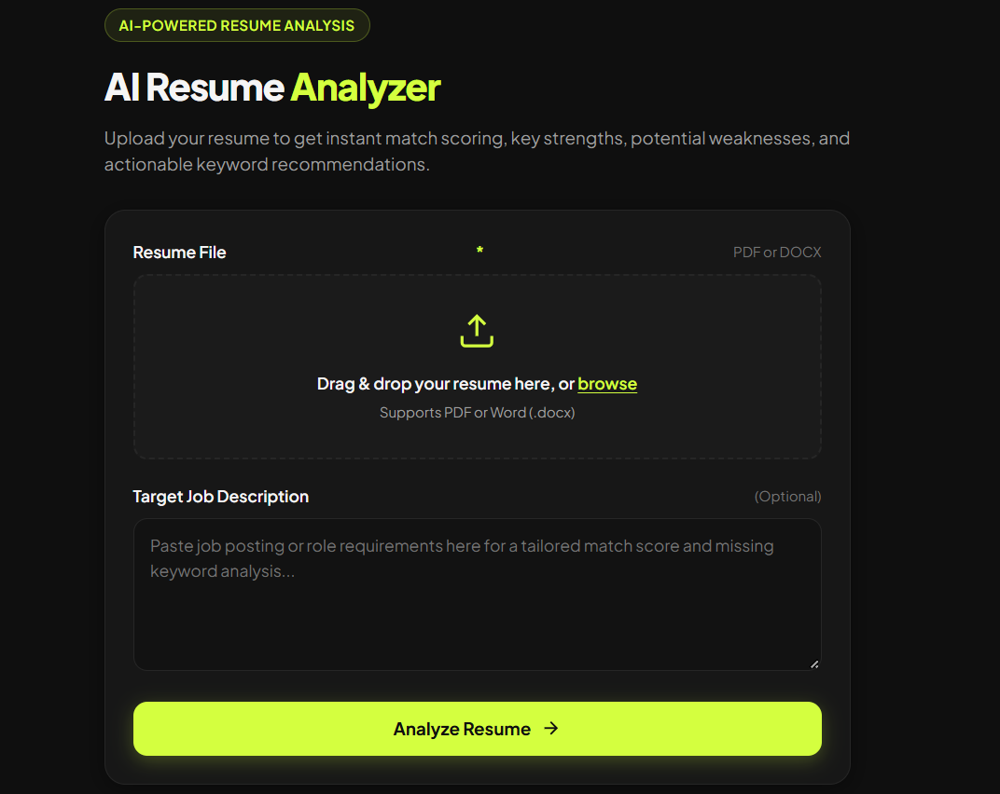

# AI Resume Analyzer

An AI-powered web app that analyzes resumes against job descriptions, giving instant match scoring, key strengths, weaknesses, and missing keyword recommendations.



## What it does

Upload a resume (PDF or DOCX) and optionally paste a job description. The app extracts the resume text, sends it to Google's Gemini AI, and returns:

- A match score out of 100
- Key strengths
- Areas for improvement
- Missing keywords/skills to add
- A summary verdict

## Tech Stack

- **Backend:** Python, Flask
- **Resume Parsing:** pdfplumber (PDF), python-docx (Word)
- **AI:** Google Gemini API
- **Frontend:** HTML, CSS, vanilla JavaScript (no frameworks)

## Running Locally

1. Clone this repo and navigate into it
2. Install dependencies:
   ```
   pip install -r requirements.txt
   ```
3. Get a free API key from [Google AI Studio](https://aistudio.google.com)
4. Create a `.env` file in the project root:
   ```
   GEMINI_API_KEY=your_key_here
   ```
5. Run the app:
   ```
   python app.py
   ```
6. Open `http://127.0.0.1:5000` in your browser

## Live Demo

https://ai-resume-analyzer-vki0.onrender.com

## Author

Built by [Salmann](https://github.com/Salmann-dev)
